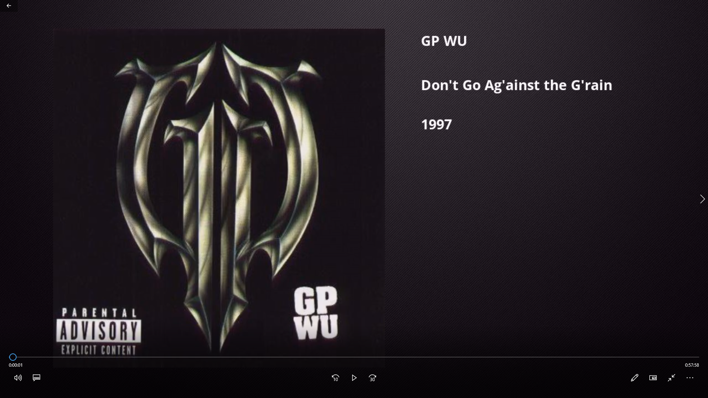

# Music-Video-Generator
Python / FFMPEG script to generate "topic" videos with album cover and metadata from either a single mp3/flac track or an album directory.

## Features
Generate video for a single track with artist name, track name, album name and year.

Generate video for an album directory with artist name, album name and year.

Output video is in 1280\*720 with the cover art being scaled to 600\*600. To alter this resolution you will need to alter the placement of the texts and the image pivot.

# Example (Album)


https://streamable.com/pb3kj

# Requirements
- FFMPEG

For single track:

- .flac / .mp3 file with embedded cover image and the following tags: "artist", "title", "album", "year" or "date" 

For directory:
- Folder with .flac / .mp3 files. First track must have embedded cover image and the above tags, except for "title".

# Command breakdown
Since this is a massive clusterfuck, here's the example of a generated ffmpeg command for the directory/album generator:

```
ffmpeg -framerate 1 

-i "D:/Programas/FFMPEG/background.jpg" //IMPORT BACKGROUND IMAGE INTO STREAM 0 (1280*720)

-i "D:\Downloads\Torrents\Music\C.O.I.N.S. - 2018 - Ancient Coins (320kbps)\01 C.O.I.N.S. - Intro.mp3" 

(... inputs)

-i "D:\Downloads\Torrents\Music\C.O.I.N.S. - 2018 - Ancient Coins (320kbps)\11 C.O.I.N.S. - Ahhh!!! Feat. Makeba Mooncycle.mp3" 

-filter_complex
"[1:v]scale=600:-1[ovrl];  //SCALE COVER ART TO 600*600

[0:V]drawtext=fontsize=25:fontfile="D:/Programas/FFMPEG/font.ttf":fontcolor=white:text={artist}:x=W/2+W/10.5:y=H/11[f1], //DRAW TEXT OVER THE BACKGROUND STREAM

[f1]drawtext=fontsize=25:fontfile="D:/Programas/FFMPEG/font.ttf":fontcolor=white:text={albumName}:x=W/2+W/10.5:y=2*(H/10)[f2], //DRAW TEXT OVER THE BACKGROUND STREAM

[f2]drawtext=fontsize=25:fontfile="D:/Programas/FFMPEG/font.ttf":fontcolor=white:text={year}:x=W/2+W/10.5:y=3*(H/10)[bg]; //DRAW TEXT OVER THE BACKGROUND STREAM

[bg][ovrl]overlay=(W-w)/7:(H-h)/2; //OVERLAY BACKGROUND (W/ TEXT) WITH COVER IMAGE

 [1:a][2:a][3:a][4:a][5:a][6:a][7:a][8:a][9:a][10:a][11:a]concat=n=11:v=0:a=1" //STITCH AUDIO STREAMS TOGETHER
 
 -c:v libx264 -r 30 -movflags +faststart "albumVideo.mp4"

```


